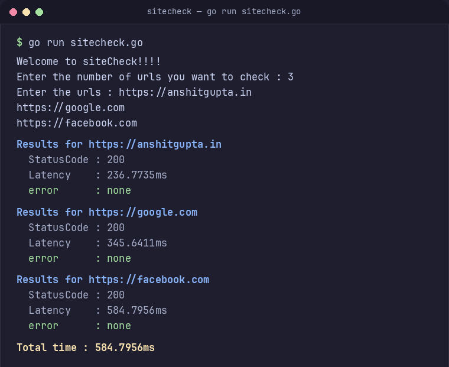

(handwritten readme ahead :P)

# SiteCheck : my first Go project 

# what it does ?
-it takes multiple urls as an input and returns their statuscode , Latency and error if any 
-it does it effectivly using concurrency , so the time taken by the process is significantly reduced  
from 2.34 sec -> 600ms 
-the total time taken by the whole process ~ max latency all url

# I built it in 3 versions so i could really understand the problem and then solve it 
v1-> checks only one url 
v2-> checks multiple urls one by one (totaltime ~ 2s)
v3-> checks multiple urls concurently (totaltime ~ 0.8s)

# output 

# try it out 

clone the repo and run it directlu 

git clone https://github.com/Anshit-Gupta/SiteCheck
go run sitecheck.go

# what i learned from this project 
-basic syntax
-defer
-struct
-error handling
-pointers 
-concurency vs parallelism 
-sync.WaitGroup
-Goroutines 
-channels

